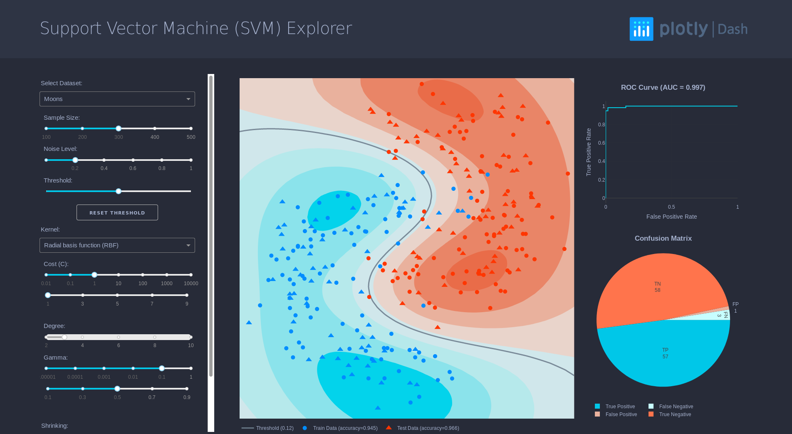

# dashr-svm
# Support Vector Machine (SVM) Explorer

This is a Dash for R version of the [SVM Explorer originally written in Python](https://github.com/plotly/dash-sample-apps/tree/master/apps/dash-svm)



## About this app:
### Using the demo
Several simulated datasets are included for this application, selectable via the dropdown menu; it's also possible to experiment by varying sample sizes and noise levels for each dataset.

The other dropdowns and sliders allow you to modify classifier parameters. Try adjusting the settings, and observe the resulting change in classifier accuracy!

### Running the app locally
Clone the git repo

```
git clone https://github.com/plotly/dashr-svm
cd dashr-svm 
```

Install the requirements. From the terminal, run the following to install the required packages in the default location:
```
R -e "install.packages(c("dash", "caret", "ROCR", "e1071", "data.table"))"
```

Run the app. From the terminal, run:
```
Rscript app.R
```

Open a browser, and enter the URL http://127.0.0.1:8050 to begin using the application.

